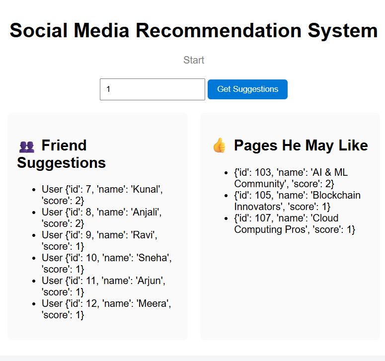

# Social Media Recommendation System 🚀

A **social media recommendation system built from scratch using pure Python**, with a clean **Flask-based web interface** to visualize recommendations. This project demonstrates how friend suggestions and page recommendations work using **mutual connections and shared interests**, without relying on heavy data science libraries.

---

## 🔍 Project Overview

Modern social media platforms rely heavily on recommendation systems to improve user engagement. This project simulates that core functionality by:

* Suggesting **people you may know** based on mutual friends
* Suggesting **pages you might like** based on shared interests
* Assigning a **score** to each recommendation to show relevance

All recommendation logic is implemented using **pure Python**, focusing on data structures and algorithmic thinking.

---

## ✨ Features

* 🔗 Friend recommendation using **mutual friends count**
* 👍 Page recommendation using **shared liked pages**
* 📊 Score-based ranking (only recommendations with score ≥ 1)
* 🧹 Data cleaning (duplicates, inactive users, blank names)
* 🖥️ Clean Flask UI for better visualization
* 📁 Structured, production-ready project layout

---

## 🛠️ Tech Stack

* **Python 3** (Pure logic, no Pandas / Scikit-learn)
* **Flask** – Backend & UI rendering
* **HTML & CSS** – Frontend design
* **JSON** – Data storage

---

## 📂 Project Structure

```
social-media-recommendation-system/
│
├── app.py                       # Flask application
├── recommendation_logic.py      # Core recommendation logic
├── requirements.txt             # Project dependencies
├── data/
│   └── massive_data.json        # Social media dataset
├── templates/
│   └── index.html               # Frontend UI
├── static/
│   └── style.css                # UI styling
└── README.md
```

---

## ⚙️ How It Works

### Friend Recommendation

* Identifies **friends of friends**
* Counts **mutual connections**
* Ranks users based on mutual friend count

### Page Recommendation

* Finds users with **shared liked pages**
* Suggests pages liked by similar users
* Assigns a score based on shared interests

---

## ▶️ How to Run the Project

1. **Clone the repository**

```bash
git clone https://github.com/anandgopalyadav/social-media-recommendation-system.git
cd social-media-recommendation-system
```

2. **Install dependencies**

```bash
pip install -r requirements.txt
```

3. **Run the Flask app**

```bash
python app.py
```

4. **Open in browser**

```
http://127.0.0.1:5000/
```

---

## 📸 Demo


---

## 🎯 Learning Outcomes

* Built a recommendation system from scratch
* Strengthened Python fundamentals & data structures
* Understood real-world recommendation logic
* Integrated backend logic with frontend UI
* Practiced clean code and project structuring

---

## 👤 Author

**Anand Gopal Yadav**
📧 Email: [anandgopal2001@gmail.com](mailto:anandgopal2001@gmail.com)
🔗 LinkedIn: [https://www.linkedin.com/in/anand-gopal-yadav-223964178](https://www.linkedin.com/in/anand-gopal-yadav-223964178)
🐙 GitHub: [https://github.com/anandgopalyadav](https://github.com/anandgopalyadav)

---

⭐ If you found this project interesting, feel free to star the repository!
